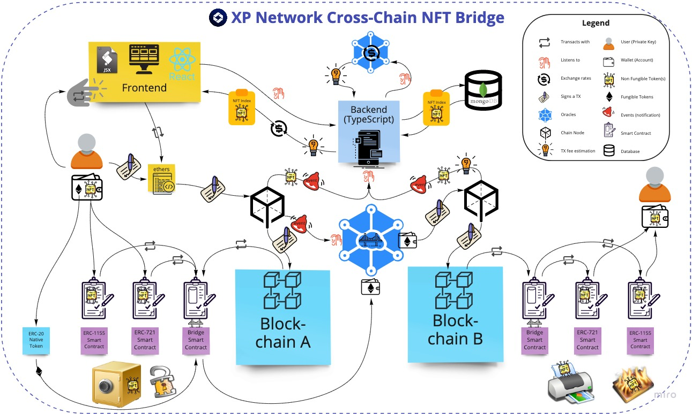

# Velas Grant Documentation

## 1. Bridge Architecture Overview

- The first of the kind [NFT multi-chain bridge](https://bridge.xp.network/) connecting a wide range of EVM to a number of Non-EVM chains. The bridge allows transferring NFTs to and from:
  - Ethereum
  - Binance Smart Chain
  - Avalanche
  - Polygon
  - Algorand
  - Fantom
  - Tron
  - Tezos
  - Elrond
  - Gnosis Chain (former xDai)
  - Fuse

### 1.1 Tech stack

| Bridge Component | Stack |
| :-: | :-: |
| Smart Contracts | Solidity |
| Validators (Oracles) | TypeScript |
| Backend | TypeScript |
| Frontend | React (JSX, TypeScript) |

### 1.2 Components interaction scheme



### 1.3 Bridging flow from the end user’s viewpoint
1. The user – we will call him Bob – first connects the wallet where his NFTs are stored to XP.network. The process is the same as for linking a wallet to a DeFi dapp.

2. The user account associated with Bob’s wallet is injected into the bridge. The bridge has a whitelisted database of NFT smart contracts, which it scans to find any NFTs that exist on Bob’s account. In more basic terms, the bridge looks for NFTs in the wallet.

3. All found NFTs are displayed in the XP.network UI (user interface). Bob can then locate the NFT he wishes to send.

4. Bob selects the origin chain (where his NFT currently resides – for example, BSC) from a drop-down list, and the target chain where the NFT should be sent – for example, Velas.

5. Bob also needs to provide the recipient address on the target chain – for instance, his own Avalanche-compatible wallet address.

6. By clicking on ‘Transfer’, Bob creates a request for transferring the NFT to the chosen account on Velas.

7. The bridge smart contract locks the NFT in its storage and broadcasts an event to the bridge relay validators, giving them all the needed information about the locked NFT and the account it should be sent to.

8. Once a validator detects the event, they send a message to the target chain (Velas) to find out how much the transaction fee is.

9. The validator notifies Bob of the transaction fee size and asks him to confirm that the fee should be deduced from his account via the wallet supported by the origin blockchain (in our case BSC).

10. The validator waits for confirmation that Bob has paid the transaction fee.

11. Once the fee has been paid, the validator signs the transfer transaction. This transaction is a tiny file containing the following instructions:

    i. which NFT should be transferred;

    ii. to which account on the target blockchain;

    iii. transaction fee to be paid to the target chain.

12. At least ⅔ +1 of the validators need to sign the transaction. The bridge smart contract on the target chain collects these signatures, and once the required majority has been reached, the contract mints a wrapped NFT. This new NFT points to the original NFT and has the same metadata.

13. The wrapped NFT is sminted to the recipient account on Velas, while the original NFT goes into custody, where it will be stored until (or in case if) Bob decides to transfer the NFT back to the original chain.

14. If an error occurs along the way, the NFT will be returned to Bob’s account on the original blockchain (BSC).
    
15. In case the NFT Owner on Velas decides to return it back to BSC, the wrapped copy will be burned on Velas and the original will be unlocked on BSC and transferred to the new Owner.

## 2. Fundamental Building Blocks

### 2.1 Smart Contracts

1. ERC-721 SC is responsible for (Unique Tokens):
   1. Minting individual NFTs
   2. Burning individual NFTs
2. ERC-1155 SC is responsible for (Unique and Fungible Tokens):
   1. Minting individual NFTs
   2. Burning individual NFTs
   3. Minting NFTs in batches
   4. Burning NFTs in batches
3. The Bridge SC is responsible for (Interacting with the Validators):
   1. Collecting the BFT Threshold
   2. Adding / Removing trusted Validators
   3. Whitelisting trusted smart contracts
   4. Accepting Foreign/Native NFTs
   5. Sending Native / Wrapped NFTs
   6. Calling the minting/burning functions of the ERC-721/ERC-1155 SCs

### 2.2 Frontend

The UI allows the user to interact with the bridge without directly invoking code. It supports a number of wallets the user can select to sign the transactions on his/her behalf. To help a user to seamlesly begin bridging he have prepared a [video walk through](https://www.youtube.com/watch?v=QZvG6MaEdW4).

1. Initial view of the [bridge](https://bridge.xp.network/#) allows to choose the chains of departure & destination.


1. A useer can choose from a range of EVM and Non-Evm chains by clicking an element of the list or type the name of the chain of interest in the search bar.


1. The wallet selection pop-up window suggests a range of wallets supported by the bridge. The wallets relevant to the departure chain are active and displayed with bright colors. The wallets relevant for other chains are inactive and therefore greyed out.
2. 

3. Our NFT-Indexer lists the NFTs a user Owns on the chain of departure


### 2.3 Backend + Token Conversion Oracles

1. Nft-Index (Returns a list of NFTs an account owns on a supported blockchain)
2. Transaction Fee Estimator - provides the TX fee on the target chain
3. Crypto-Currency Converter (Oracle) converts the target fee to the native tokens of the original chain via USDT equivalent.

### 2.4 Relay Validators (Oracles)
1. Private (SK) & Public (PK) key pairs for all the connected chains
2. Validation logic
   1. Chain Event catching
   2. Event deserialization
   3. Transaction composition
   4. Transaction submition to the target chain
3. Velas Node 
   1. able to accept transactions
   2. Deliver events to the validators


## 3. Algorithms & Protocols Core to the Project
Back in 1943, Warren McCulloch and Walter Pitts published a fundamental paper on state machines – abstract devices that are always in one (and only one) out of a set number of stable states, depending on their previous state and on the inputs they receive. The paper describes several types of such finite-state machines:

  **Acceptors** can either accept an input or not<br>
  **Recognizers** can recognize an input or not<br>
  **Transducers** can generate output from a given input<br>
  The concept of finite-state machines can be applied to the XP.network bridge validators:

  Bridge relay validators have a finite set of states `S = {s1 … ss}` - [idle, handling an event, paused, signing a transaction, reverting a transaction]

  There is a finite finite set of inputs that a validator can receive: either events broadcast by the smart contracts or results of computations (inputs `I = {i1 … iJ}`)

  There is also a finite set of output symbols `O = {o1 … oo}` - [none, signature, smart contract address, +/- Validator credential`s]
  States and inputs are mapped onto the so-called state transition function to determine the next state: `I x S → S’`

  Inputs and states are also mapped onto the output function to determine the output: `I x S -> O`

  The table below synthesizes all the possible combinations of validator states, inputs, outputs, and resulting states that can be produced. Each of these combinations corresponds to one of the state machine types: acceptor, recognizer, or transducer.

  Current State (Sx) |	Input (Ix) |	Output (Ox)	 | Next State (S’)
  |:---:|:---:|:---:|:---:|
  |Validator as a Recognizer|
  Idle (listening)|	Unrecognized event|	none	|Idle (listening)
  Idle (listening)|	Recognised event  |none	|HandleEvent
  |Validator as a Transducer|
  HandleEvent|	TransferUnique|	none|	SignTransaction
  HandleEvent|	WhitelistNft|	+1 SC address|	Idle (listening)
  HandleEvent|	PauseBridge|	none|	Paused
  Paused|	UnpauseBridge|	none|	Idle (listening)
  HandleEvent|	AddValidator|	+1 Validator|	Idle (listening)
  HandleEvent|	RemoveValidator|	-1 Validator|	Idle (listening)
  SignTransaction|	Error|	none|	RevertTransaction
  SignTransaction|	Success|	PK signature|	Idle (listening)
  RevertTransaction|	none|	PK signature|	Idle (listening)

  A validator’s on-chain multisignature element resides in the bridge smart contract and acts as an acceptor FSM under the control of the bridge validators. The result largely depends on how many validator signatures for a certain transaction have been collected:

  Current State (Sx)|	Input (Ix)|	Output (Ox)|	Next State (S’)
  |:---:|:---:|:---:|:---:|
  Idle (listening)|	none|	none|	Idle (listening)
  Idle (listening)|	Signatures < BFT threshold|	none|	Calculate BFT Threshold
  Calculate BFT Threshold|	Signatures < BFT threshold|	none|	Calculate BFT Threshold
  Calculate BFT Threshold|	Signature >= BFT threshold|	Release NFT to the destination account|	Idle (listening)

  Since the flow of the bridged blockchain events is theoretically unlimited, the entire bridge can be represented as a Turing machine, or a finite-state machine with unlimited memory. This Turing machine reacts to the never-ending string of inputs in the form of events. In turn, bridged blockchains can be described as communicating vessels: if the number of tokens diminishes in one of the vessels, they ought to appear in the same volume and with the same characteristics in the other.

## 4. Milestone Deliverables

| Number | Deliverable | Specification |
|-|-|-|
| 1 | Documentation | We will provide both inline documentation of the code and a basic tutorial that can interact with the deployed smart contracts and backend service. |
| 2 | Smart Contracts | We have developed smart contracts that are able to:<br>1. Support ERC-721 `0x3F888c0Ee72943a3Fb1c169684A9d1e8DEB9f537`<br>2. Support ERC-1155 `0x0cC5F00e673B0bcd1F780602CeC6553aec1A57F0`<br>3. Bridge SC `0x40d8160A0Df3D9aad75b9208070CFFa9387bc051`<br> 4. Freeze/Unfreeze Native NFTs in batches<br>5. Mint/Burn wrapped NFTs in batches<br>6. Pay the TX fees on the target chain in native tokens<br>7. Send / Receive NFTs in batches<br>8. Withdraw TX fees in the native tokens for the target chain |
| 3 | Validators | 1. We've set up the Velas Node for listening to the events (Maintainance costs EUR 200/month)<br>2. Added the logic to the validators to listen to & validate the TX to/from Velas |
| 4 | Backend | Integration of Velas in the:<br>1. [NFT Index](https://indexnft.herokuapp.com) Requires JWT<br>2. TX Fee Estimator<br>3. [Crypto-currency converter](https://testing-bridge.xp.network/exchange/)<br> 4. [Heartbeat](https://xpheartbeat.herokuapp.com) - checks whether the Velas Node & validators areup and operating properly |
| 5 | Frontend | Integration of Velas in the:<br>1. User Interface<br> 2. Wallets (Metamask, TrustWallet, WalletConnect) |
| 6 | Whitelisted SCs | 1. 0x43f7eA266b08f3E2470c9295CD270FbD6636ae8e<br>2. 0x20AB7a2678b6911b71B2d464661EBD2540f39da6<br>3. 0xD44264fa0a3f0B34c40edbF42A456145A29E186a<br>4. 0x948E8c6E0c9035f7372a10e10f9f71cC81341053<br>5. 0xb73CC6D7a621E0e220b369C319DBFaC258cEf4D2<br> 6. 0xFC966b221fb8ee64f2e7535b3c5c1cc19Bb4Ac93<br>7. 0xF62a8a8af4E1b78053f8F53F0c8f2d2146780B92<br>8. 0x36DCc6111b5FBF8C25484EBa8B4b39DEA5206a88<br>9. 0x6AAe361F01Ca0A51727426222bD465A0De0dBAbe |

## Testnet Smart contracts
|Contract|Address|
|:-:|:-:|
|UserNftMinter|0x5df32A2F15D021DeF5086cF94fbCaC4594208A26|
|Erc1155Minter|0x941972fa041F507eBb8CfD5d11C05Eb1a51f2E95|
|XPNft1155|0x5D822bA2a0994434392A0f947C83310328CFB0DE|
|XPNft|0xE657b66d683bF4295325c5E66F6bb0fb6D1F7551|
|Minter|0x5051679FEDf0D7F01Dc23e72674d0ED58de9be6a|

## 5. Future Plans

Our long term plans include:
1. Running a Velas Node for listening to the chain events and submitting bridge transactions
2. Mainnet integration to Cardano, Solana, Polkadot ecosystem, Cosmos ecosystem, EOS compatible chains, NEO
3. ERC-721A New smart contract support (allows minting and burning in batches)
4. Forged NFT detection on all the bridged chains
5. NFT explorer for finding NFT’s with deleted storage
6. NFT meta backup to secure transactions
7. Distributed NFT’s hosting (better than IPFS)
8. NFT Search (search by any parameter)
9. Retention protection tool

## 6. Successful Mainnet NFT Transfers

Sending from Velas to Ethereum:<br/>
https://evmexplorer.velas.com/tx/0xe406dbebd2134a775ed47b42ffa94540aa52cce8d7efba23b9c21e58a6e51d6e/logs


Arrival on Ethereum:<br/>
https://etherscan.io/tx/0x00101a558540f5e9a764d68fa8cd66ac32c75f741bd9df82684dffbfa4263aaa


## 7. Trying Velas in Testnet

### 7.1. Initiating a Node.js project
Initiate a JS/TS project

```bash
mkdir your_project
cd your_project/
yarn init -y
```

### 7.2. Installing the libraries

To test/use the latest commits of the library install directly from github

```bash
yarn add "git+https://github.com/xp-network/xpjs#bleeding-edge" @elrondnetwork/erdjs ethers @taquito/taquito @temple-wallet/dapp dotenv
```

### 7.3. Importing the Dependencies

```ts
import {
    ChainFactoryConfigs,  ChainFactory,
    ElrondHelper,         ElrondParams,
    TronHelper,           TronParams,
    Web3Helper,           Web3Params,
    AppConfigs,
    NftMintArgs,          Chain
} from "xp.network";
import {config} from 'dotenv';
config();
  
// Instantiate the chain factory for the TESTNET
const testnetConfig = ChainFactoryConfigs.TestNet();
const factory = ChainFactory(AppConfigs.TestNet(), testnetConfig);
```

### 7.4. Creating a signer object

Add a `.env` file and populate it with the Private Key of the signer

```bash
touch .env
echo "SK=<replace with your Provate Key>" >> .env
```
Add the signer object:
```ts
// EVM chains compatible wallet:
import { Wallet } from "ethers";
// EVM signer for testing in the BE
const signer = new Wallet(
  //  Private Key Of the Signer
  process.env.SK!,
  testnetConfig.velasParams?.provider
);
// Print out your signer object to see that it matches the expected wallet
console.log("signer", signer);
```

### 7.5. Creating inner Blockchain objects

```ts
(async () => {
  // EVM-compatible chains:
  // Inner Object ============= Chain Nonce == Chain Nonce ==
  const bsc       = await factory.inner<4>(Chain.BSC);
  const ethereum  = await factory.inner<5>(Chain.ETHEREUM);
  const avax      = await factory.inner<6>(Chain.AVALANCHE);
  const polygon   = await factory.inner<7>(Chain.POLYGON);
  const fantom    = await factory.inner<8>(Chain.FANTOM);
  const velas     = await factory.inner<19>(Chain.VELAS);
  const gnosis    = await factory.inner<14>(Chain.XDAI);
  const harmony   = await factory.inner<12>(Chain.HARMONY);
  // To view an inner object:
  console.log("bsc:", bsc);
})();
```

### 7.6. Minting NFTs for testing

```ts
(async () => {
   const nftResult = await factory.mint(
      velas,
      rocess.env.SK!,
      {
        contract: "0x5df32A2F15D021DeF5086cF94fbCaC4594208A26",
        uris:["<Replace with your metadata URI>"]
      } as NftMintArgs
   );
   console.log("Minting result:", nftResult);
})();
```

### 7.7. Getting a list of NFTs a user owns on a Blockchain

```ts
(async () => {
  // Getting a list of NFTs
  const velasNFTs = await factory.nftList(
    velas,            // The inner chain object
    signer.address  // The public key of the user
  );
  // To view a list of NFTs:
  console.log("NFTs:", velasNFTs);
})();
```

### 7.8. Transferring an NFT
```ts
(async () => {
    // Calling the function:
    const result = await factory.transferNft(
    velas,                      // The Source Chain.
    ethereum,                   // The Destination Chain.
    bscNFTs[0],                 // The NFT selected by the index.
    signer,                     // The web3 signer object.
    "ADDRESS OF THE RECEIVER"   // The address who you are transferring the NFT to.
  );
  console.log(web3Result);
})();
```